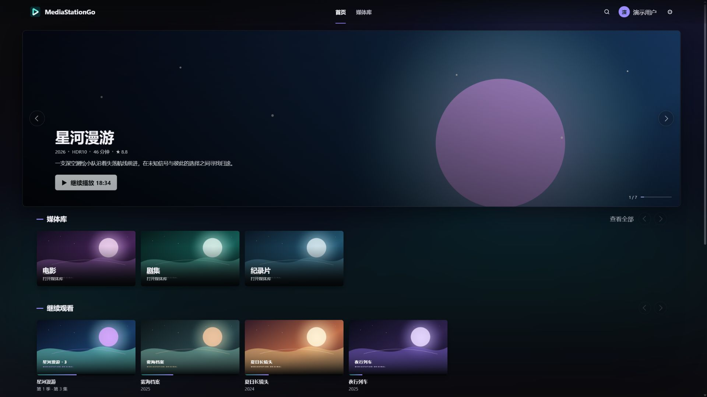
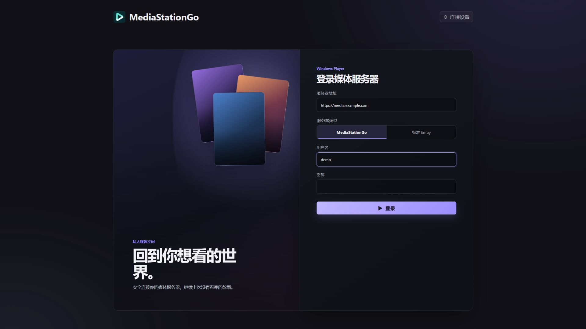
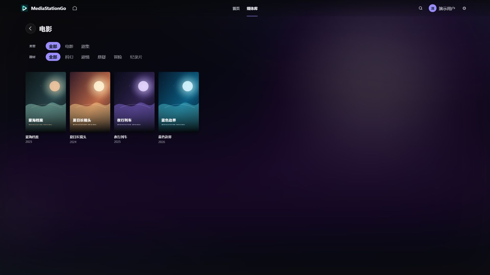
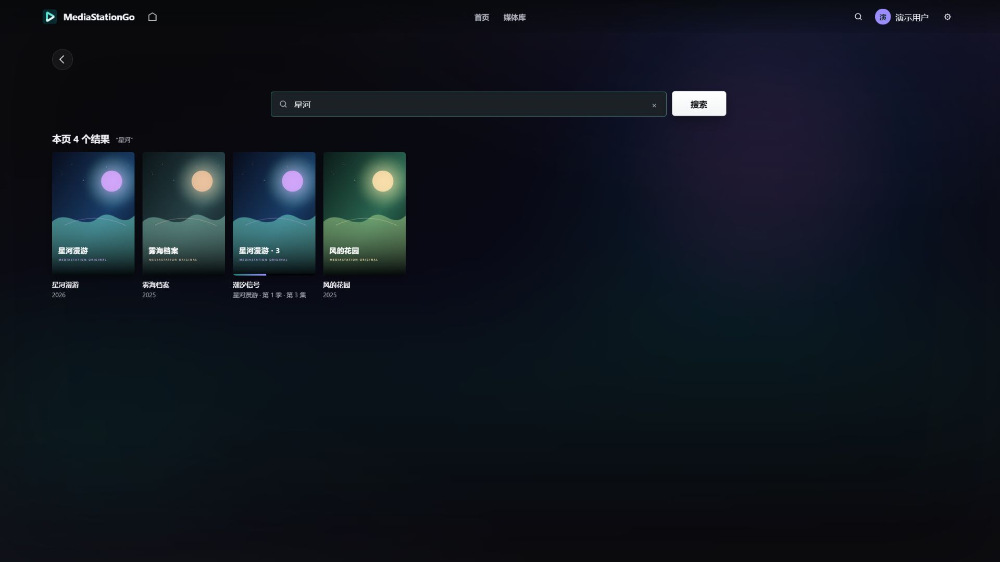
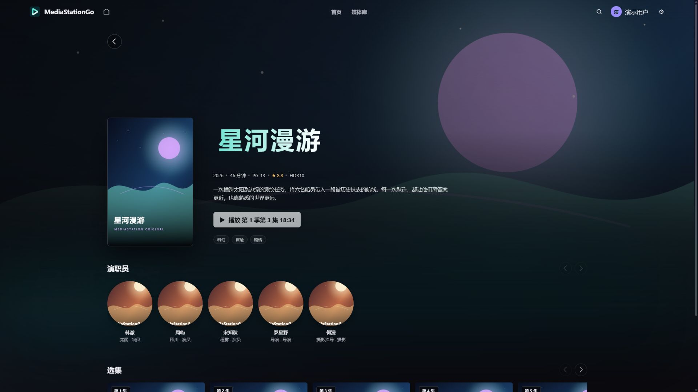
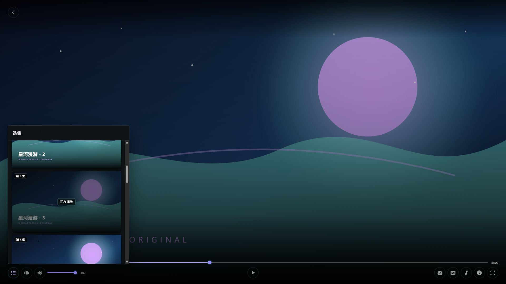
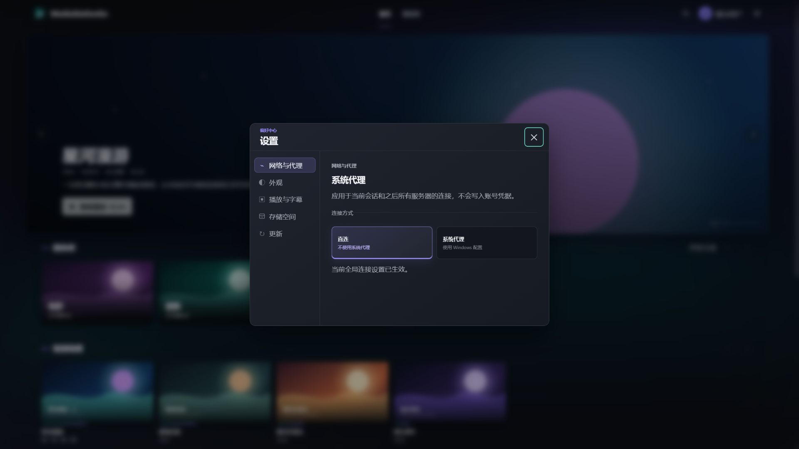
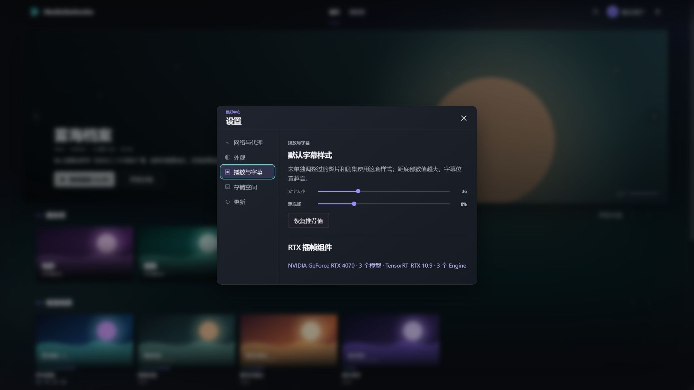
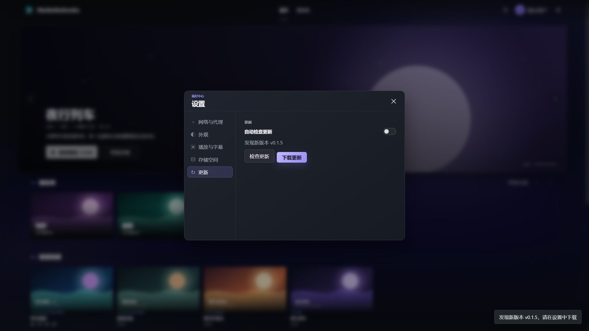

# MediaStationGo for Windows

[](https://github.com/timefunnel/MediaStationGo-Windows/releases/latest)
[](https://github.com/timefunnel/MediaStationGo-Windows/releases/latest)
[](LICENSE)

MediaStationGo for Windows 是面向 [MediaStationGo](https://github.com/timefunnel/MediaStationGo) 与标准 Emby 服务器的原生 Windows 媒体客户端。它以 CEF 构建桌面媒体界面，以 libmpv 负责原生播放，并由 Rust 层统一管理账号、媒体请求、播放会话和应用更新。

[下载最新版本](https://github.com/timefunnel/MediaStationGo-Windows/releases/latest) · [提交问题](https://github.com/timefunnel/MediaStationGo-Windows/issues) · [Windows 发布流程](docs/windows-release-process.md)



## 核心功能

- **完整媒体浏览**：首页推荐、继续观看、媒体库、类型与题材筛选、搜索、详情、演职员、分季选集。
- **原生播放控制**：硬件解码、HDR10、播放进度、倍速、音量、全屏、音轨与字幕切换，以及默认或单片字幕样式。
- **剧集连续观看**：播放器内选集、自动播放下一集、片头片尾跳过设置；退出播放后立即更新“继续观看”。
- **多服务器与多账号**：支持 MediaStationGo 和标准 Emby，可保存、切换、修改或删除多个账号。
- **安全原生会话**：密码和访问令牌保存在 Windows 凭据管理器中，不暴露给页面脚本；媒体重定向与跨域请求按来源限制凭据。
- **网络与代理**：可在应用内切换直连或 Windows 系统代理，设置作用于当前会话及后续服务器连接。
- **直链与 CDN 播放**：原生解析播放信息、验证重定向与 Range 支持，并复用已经验证的最终播放地址。
- **应用内更新**：直接检查 GitHub Releases，下载并校验更新包；安装版启动安装程序，便携版可在应用内完成替换。
- **可选 RTX 插帧**：内置三档 RIFE TensorRT-RTX 模型，可按影片启用严格 2 倍插帧，并明确展示组件和 Engine 状态。

## 界面预览

以下截图均使用虚构的片名、账号、服务器地址和版本号，仅用于展示界面，不包含真实媒体库或凭据。

<table>
  <tr>
    <td width="50%">
      
      <br><strong>账号连接</strong><br>选择 MediaStationGo 或标准 Emby，并配置服务器与客户端身份。
    </td>
    <td width="50%">
      
      <br><strong>媒体库</strong><br>按媒体类型与题材筛选，以海报网格浏览内容。
    </td>
  </tr>
  <tr>
    <td width="50%">
      
      <br><strong>搜索</strong><br>统一搜索电影、剧集与单集，并直接进入详情。
    </td>
    <td width="50%">
      
      <br><strong>详情与选集</strong><br>集中展示简介、评分、格式、演职员和继续播放位置。
    </td>
  </tr>
  <tr>
    <td width="50%">
      
      <br><strong>播放器</strong><br>播放进度、音量、倍速、音轨、字幕、RTX 插帧与播放器内选集。
    </td>
    <td width="50%">
      
      <br><strong>网络与代理</strong><br>在直连与 Windows 系统代理之间明确切换。
    </td>
  </tr>
  <tr>
    <td width="50%">
      
      <br><strong>播放与字幕</strong><br>调整默认字幕样式，并查看 RTX、模型和 Engine 状态。
    </td>
    <td width="50%">
      
      <br><strong>应用内更新</strong><br>检查、下载并确认应用 GitHub Release 更新。
    </td>
  </tr>
</table>

## 下载与安装

前往 [Releases](https://github.com/timefunnel/MediaStationGo-Windows/releases/latest) 下载最新 Windows x64 版本：

- `MediaStationGo-<版本>-windows-x64-setup.exe`：当前用户安装程序，适合日常使用，不要求管理员权限。
- `MediaStationGo-<版本>-windows-x64-portable.zip`：便携包，完整解压后运行 `jellium-desktop.exe`。
- `SHA256SUMS.txt`：安装包、便携包和源码包的 SHA-256 校验值。

便携版需要保留压缩包中的完整目录结构，不能只复制主程序。首次启动后，安装版和便携版都可以在“设置 → 更新”中检查新版本。

可在 PowerShell 中计算文件校验值：

```powershell
Get-FileHash .\MediaStationGo-<版本>-windows-x64-setup.exe -Algorithm SHA256
```

将结果与同一 Release 中的 `SHA256SUMS.txt` 对照后再运行。

## 快速开始

1. 安装应用，或完整解压便携包后运行 `jellium-desktop.exe`。
2. 添加账号，填写完整的 `http://` 或 `https://` 服务器地址、服务器类型、用户名和密码。
3. 标准 Emby 可按服务器兼容性选择默认身份、SenPlayer 或 Infuse；MediaStationGo 使用原生连接配置。
4. 如需使用 Windows 系统代理，在登录页或右上角“设置 → 网络与代理”中切换。
5. 登录后从首页、媒体库或搜索进入详情页并开始播放。

账号抽屉用于管理已保存账号；设置中心可调整主题、网络、默认字幕、图片缓存、RTX 插帧组件和应用更新。

## 系统要求

- Windows x64。
- 可访问的 MediaStationGo 或标准 Emby 服务器，以及有效账号。
- 支持目标视频格式的显卡和驱动；实际硬件解码与 HDR 输出能力取决于设备、驱动和显示链路。

RTX 插帧是可选功能，不影响普通播放。启用它还需要：

- NVIDIA RTX 显卡和可用的 NVIDIA 驱动。
- 20–30 FPS 片源；当前执行严格 2 倍插帧。
- 显示器当前刷新率不低于目标帧率。
- SDR 或 HDR10 内容。HLG 尚未开放，HDR10+ 与 Dolby Vision 不支持插帧。

不满足条件时，应用会明确说明原因，不会静默切换模型或伪装成插帧成功。

## RTX 插帧档位

| 档位 | 模型 | 取向 |
| --- | --- | --- |
| 质量优先 | RIFE v4.26 | 优先画面质量 |
| 均衡优先 | RIFE v4.26 · Scale 0.5 | 平衡质量与推理开销 |
| 流畅优先 | RIFE v4.25 Lite | 优先较低推理开销 |

首次使用某个档位时，应用会为当前显卡和驱动准备对应的 TensorRT Engine。Engine 缓存与具体 GPU、驱动和运行时绑定；环境变化后可能需要重新生成。

## 安全与问题反馈

请不要在公开 Issue 中粘贴访问令牌、密码、完整服务器地址、带签名的媒体地址或未脱敏日志。

报告问题时，请提供：

- 应用版本和安装方式。
- Windows 版本、显卡型号和驱动版本。
- 服务器类型（MediaStationGo 或标准 Emby）。
- 可复现步骤、预期结果和实际错误信息。
- 已脱敏的相关日志。

请通过 [GitHub Issues](https://github.com/timefunnel/MediaStationGo-Windows/issues) 提交问题。

## 开发

项目是以 `src/Cargo.toml` 为入口的 Rust 2024 workspace。Windows 构建需要 Git、Rust、[just](https://github.com/casey/just)、PowerShell 7、Visual Studio 2022 C++ Build Tools，以及项目脚本所需的 MSYS2/libclang 环境。

```powershell
git clone --recurse-submodules https://github.com/timefunnel/MediaStationGo-Windows.git
cd MediaStationGo-Windows
just build
```

常用检查：

```powershell
just test
just lint
```

首次构建会准备 CEF、mpv 和其他原生依赖，耗时与磁盘占用会明显高于普通 Rust 项目。Windows 候选包和正式版本使用“构建一次、测试后原样晋升”的流程，详见 [Windows 发布流程](docs/windows-release-process.md)。

## 许可证与致谢

本项目基于 [Jellium Desktop](https://github.com/andrewrabert/jellium-desktop) 的原生窗口、CEF 与 mpv 集成继续开发，并使用 CEF、mpv、FFmpeg、libplacebo、RIFE、TensorRT-RTX 等开源或可再分发组件。

项目源码采用 [GNU GPL v2.0](LICENSE)。第三方组件适用各自许可证；正式发布包会附带对应的许可证与说明文件。
